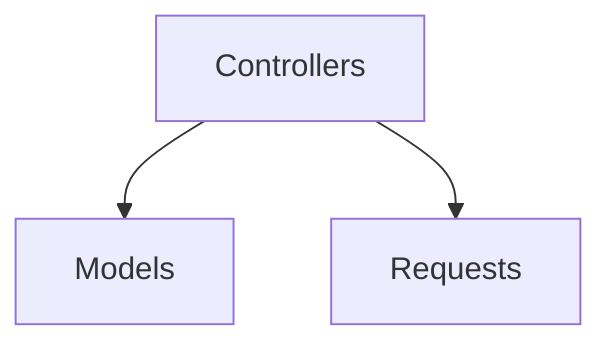

# Code Documentation Summary

## Tóm tắt công việc đã hoàn thành

Tôi đã thêm **comments chi tiết** cho toàn bộ code Controllers, Models và Requests để giúp bạn dễ hiểu hơn. Các comments được viết bằng **Tiếng Việt** để dễ theo dõi.

---

## 📂 Các file đã được cập nhật

### 1. Controllers (3 files)

#### CourseController (`app/Http/Controllers/CourseController.php`)
**Giải thích:**
- `index()` - Liệt kê khóa học với tìm kiếm, lọc, sắp xếp, phân trang
- `create()` - Hiển thị form tạo khóa học
- `store()` - Lưu khóa học mới (xác thực, upload ảnh, auto-generate slug)
- `show()` - Hiển thị chi tiết khóa học với bài học và học viên
- `edit()` - Hiển thị form chỉnh sửa
- `update()` - Cập nhật khóa học
- `destroy()` - Soft delete khóa học
- `restore()` - Khôi phục khóa học đã xóa
- `forceDelete()` - Xóa vĩnh viễn khóa học
- `dashboard()` - Hiển thị thống kê dashboard

**Comments bao gồm:**
- Mô tả từng method
- Giải thích logic xử lý
- Công thức tính toán (ví dụ: revenue = price × enrollment count)
- Cách sử dụng các relationship và scope

#### LessonController (`app/Http/Controllers/LessonController.php`)
**Giải thích:**
- Quản lý bài học lồng nhau (nested) dưới khóa học
- Tất cả route đều là nested: `/courses/{course}/lessons`
- 7 methods: index, create, store, show, edit, update, destroy

**Comments bao gồm:**
- Route binding như thế nào hoạt động
- Relationship eager loading để tối ưu performance
- Cách gán course_id cho bài học

#### EnrollmentController (`app/Http/Controllers/EnrollmentController.php`)
**Giải thích:**
- Quản lý đăng ký khóa học
- Tạo hoặc lấy học viên dựa trên email (firstOrCreate logic)
- Xem đăng ký theo khóa học cụ thể

**Comments bao gồm:**
- firstOrCreate pattern giúp học viên có thể đăng ký nhiều khóa học
- Eager loading để tránh N+1 query
- Phân trang và đếm học viên

---

### 2. Models (4 files)

#### Course Model (`app/Models/Course.php`)
**Attributes:**
- id, name, slug, price, description, image, status, timestamps, deleted_at

**Relationships:**
- `lessons()` - hasMany: 1 khóa học có nhiều bài học
- `enrollments()` - hasMany: 1 khóa học có nhiều đăng ký
- `students()` - belongsToMany: N-N qua bảng enrollments

**Scopes (Query Builders):**
- `published()` - Lọc status = 'published'
- `draft()` - Lọc status = 'draft'
- `priceBetween($min, $max)` - Lọc theo giá
- `searchByName($name)` - Tìm kiếm theo tên
- `filterByStatus($status)` - Lọc theo trạng thái

**Methods:**
- `getEnrollmentCount()` - Đếm số đăng ký
- `getTotalRevenue()` - Tính doanh thu = giá × số đăng ký

**Comments bao gồm:**
- Mô tả chi tiết từng relationship
- Cách dùng các scope với ví dụ
- Công thức tính toán

#### Lesson Model (`app/Models/Lesson.php`)
**Attributes:**
- id, course_id (FK), title, content, video_url, order, timestamps

**Relationships:**
- `course()` - belongsTo: 1 bài học thuộc 1 khóa học

**Comments bao gồm:**
- Giải thích role của order field
- Relationship N-1

#### Student Model (`app/Models/Student.php`)
**Attributes:**
- id, name, email, timestamps

**Relationships:**
- `courses()` - belongsToMany: N-N qua enrollments
- `enrollments()` - hasMany: 1 học viên có nhiều đăng ký

**Comments bao gồm:**
- Email là identifier duy nhất
- Relationship N-N và 1-N

#### Enrollment Model (`app/Models/Enrollment.php`)
**Attributes:**
- id, course_id (FK), student_id (FK), timestamps

**Relationships:**
- `course()` - belongsTo: Mỗi đăng ký liên quan đến 1 khóa học
- `student()` - belongsTo: Mỗi đăng ký liên quan đến 1 học viên

**Comments bao gồm:**
- Giải thích pivot table pattern
- Relationship N-1 từ cả hai phía

---

### 3. Form Requests (3 files)

#### CourseRequest (`app/Http/Requests/CourseRequest.php`)
**Validation Rules:**
```
- name: required | string | max:255
- slug: nullable | unique (duy nhất, loại trừ bản ghi hiện tại trong update)
- price: required | numeric | min:0.01
- description: required | string
- image: nullable | image | mimes:jpeg,png,jpg,gif | max:2048
- status: required | in:draft,published
```

**Comments bao gồm:**
- Giải thích mỗi rule
- Cách slug validation loại trừ bản ghi hiện tại
- Thông báo lỗi Tiếng Việt cho mỗi trường

#### LessonRequest (`app/Http/Requests/LessonRequest.php`)
**Validation Rules:**
```
- title: required | string | max:255
- content: required | string
- video_url: nullable | url
- order: required | integer | min:0
```

**Comments bao gồm:**
- Giải thích từng rule
- Thông báo lỗi Tiếng Việt

#### EnrollmentRequest (`app/Http/Requests/EnrollmentRequest.php`)
**Validation Rules:**
```
- course_id: required | exists:courses,id (referential integrity check)
- name: required | string | max:255
- email: required | email | unique:students,email
```

**Comments bao gồm:**
- Giải thích exists rule kiểm tra referential integrity
- Giải thích unique rule cho email
- Thông báo lỗi Tiếng Việt

---

## 🎯 Điểm nổi bật của các comments

1. **Chi tiết và rõ ràng** - Mỗi method, property có mô tả cụ thể
2. **Tiếng Việt** - Dễ theo dõi cho developer Việt Nam
3. **Ví dụ thực tế** - VD: "Khóa PHP" → "khoa-php-1712435200"
4. **Công thức toán học** - VD: revenue = price × enrollment count
5. **Pattern giải thích** - VD: firstOrCreate pattern, N-N relationships
6. **Performance tips** - VD: Eager loading để tránh N+1 queries
7. **Validation giải thích** - Mô tả chi tiết các rule validation

---

## 📊 Sơ đồ Mermaid trong README

### 1. Architecture Diagram

Hiển thị mối quan hệ giữa Controllers, Models, và Requests

### 2. Database ER Diagram
```mermaid
erDiagram
    COURSE ||--o{ LESSON
    COURSE ||--o{ ENROLLMENT
    STUDENT ||--o{ ENROLLMENT
```
Hiển thị các relationship trong database

---

## ✅ Kiểm tra lỗi

Tất cả 10 files đã được kiểm tra cú pháp PHP:
- ✅ CourseController.php - No syntax errors
- ✅ LessonController.php - No syntax errors
- ✅ EnrollmentController.php - No syntax errors
- ✅ Course.php - No syntax errors
- ✅ Lesson.php - No syntax errors
- ✅ Student.php - No syntax errors
- ✅ Enrollment.php - No syntax errors
- ✅ CourseRequest.php - No syntax errors
- ✅ LessonRequest.php - No syntax errors
- ✅ EnrollmentRequest.php - No syntax errors

---

## 🚀 Tiếp theo

Bạn có thể:
1. Mở các file để xem comments chi tiết
2. Dùng IDE để navigate qua các relationships
3. Tham khảo comments khi coding features mới
4. Share với team members để cùng hiểu codebase

---

**Tất cả code đã được documented chi tiết!** 🎉

