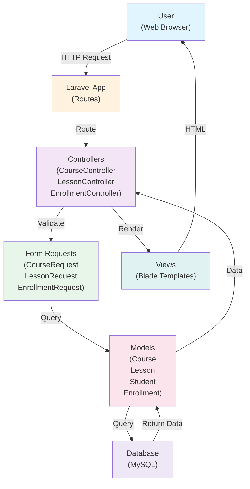
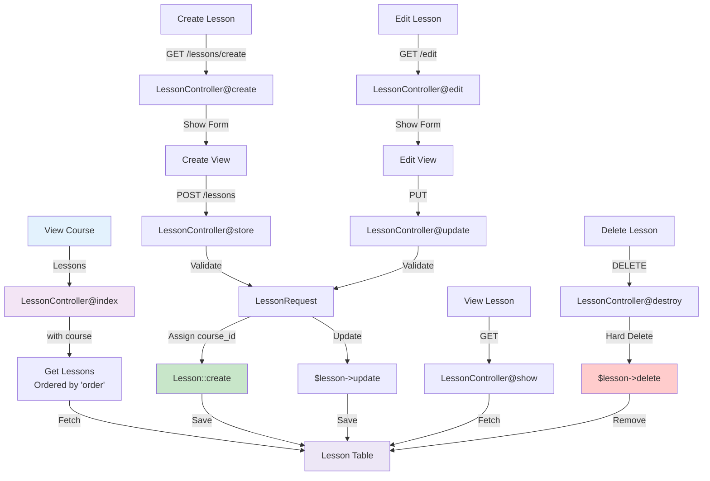
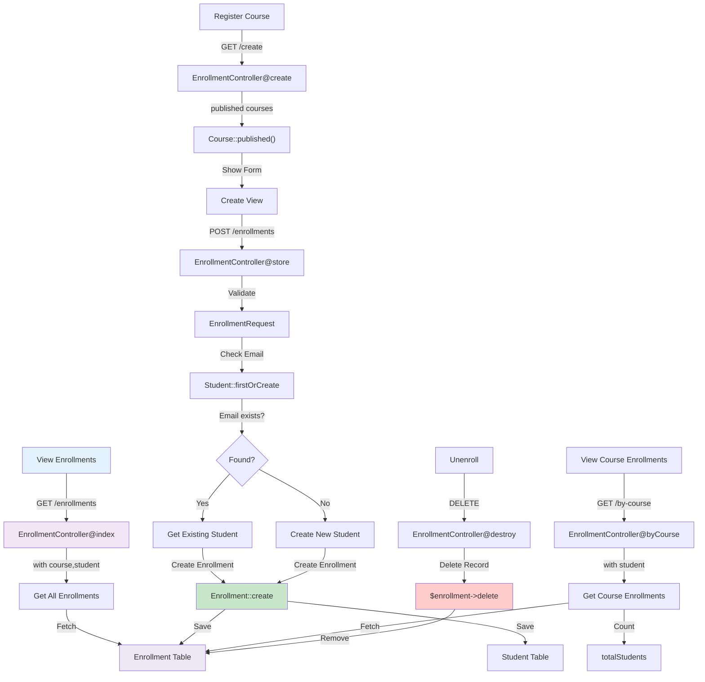
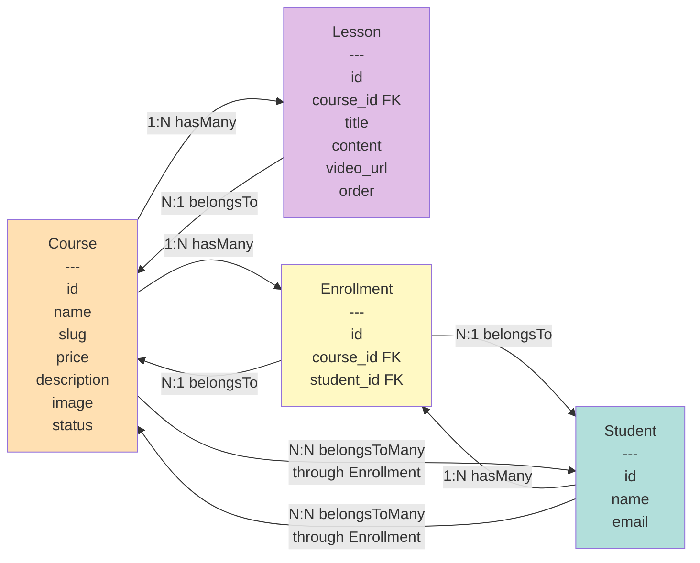
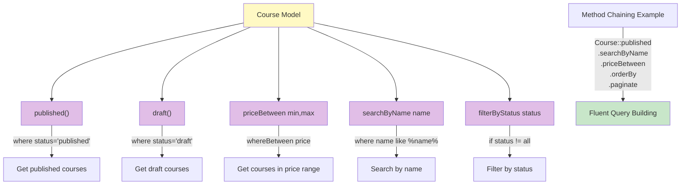
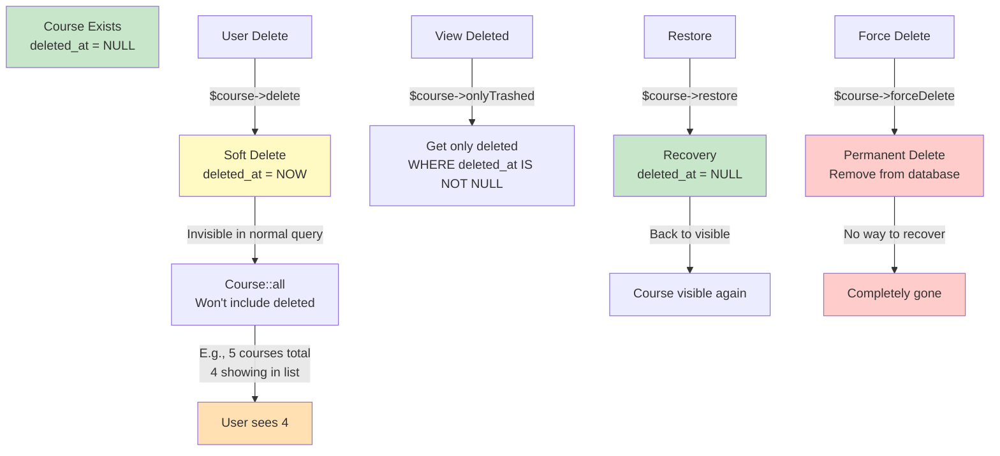
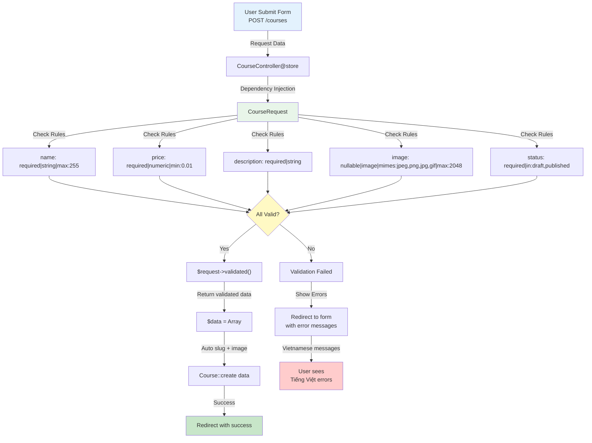
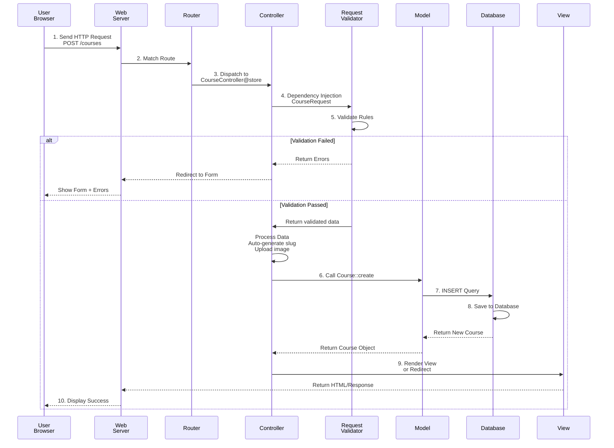

# Mermaid Diagrams - Tất cả sơ đồ chi tiết

## 1. Data Flow Diagram (Luồng dữ liệu)



## 2. Course Management Workflow

```mermaid
flowchart TD
    A["Dashboard"] -->|View Courses| B["CourseController@index"]
    B -->|Search/Filter| C["Course Scopes<br/>published()/draft()<br/>searchByName()<br/>priceBetween()"]
    C -->|Query| D["Get Courses List"]
    
    E["Create Course"] -->|GET /courses/create| F["CourseController@create"]
    F -->|Show Form| G["Create View"]
    G -->|POST /courses| H["CourseController@store"]
    H -->|Validate| I["CourseRequest"]
    I -->|Auto-generate slug<br/>Upload image| J["Course::create"]
    J -->|Save| K["Courses Table"]
    K -->|Redirect| L["Success Message"]
    
    M["Edit Course"] -->|GET /courses/id| N["CourseController@show"]
    N -->|GET /courses/id/edit| O["CourseController@edit"]
    O -->|Show Form| P["Edit View"]
    P -->|PUT /courses/id| Q["CourseController@update"]
    Q -->|Validate| I
    I -->|Update| R["$course->update"]
    R -->|Save| K
    
    S["Delete Course"] -->|DELETE| T["CourseController@destroy"]
    T -->|Soft Delete| U["$course->delete<br/>Set deleted_at"]
    U -->|Save| K
    
    V["Recover Course"] -->|POST /restore| W["CourseController@restore"]
    W -->|onlyTrashed()| X["Find Deleted"]
    X -->|Restore| Y["$course->restore<br/>Clear deleted_at"]
    Y -->|Save| K
    
    Z["Permanent Delete"] -->|DELETE /force| AA["CourseController@forceDelete"]
    AA -->|forceDelete()| AB["Hard Delete"]
    AB -->|Remove| K
    
    style A fill:#e3f2fd
    style B fill:#f3e5f5
    style K fill:#ede7f6
    style L fill:#c8e6c9
```

## 3. Lesson Management Workflow



## 4. Enrollment Management Workflow



## 5. Model Relationships



## 6. Query Scopes Usage



## 7. Soft Delete Lifecycle



## 8. Form Validation Flow



## 9. Dashboard Statistics

```mermaid
flowchart TD
    A["GET /dashboard"]
    A -->|CourseController@dashboard| B["Collect Statistics"]
    
    B -->|Course::count| C["Total Courses"]
    C -->|E.g. 15| D["15 courses"]
    
    B -->|Student::count| E["Total Students"]
    E -->|E.g. 120| F["120 students"]
    
    B -->|Calculate Revenue| G["Total Revenue"]
    G -->|For each course| H["price × enrollmentCount"]
    H -->|Sum all| I["10,500,000 VND<br/>e.g."]
    
    B -->|Find top course| J["Top Course"]
    J -->|Sort by enrollment count| K["Most popular"]
    K -->|E.g. PHP Basics<br/>45 students| L["Top Course"]
    
    B -->|Recent courses| M["Latest 5 Courses"]
    M -->|Order by created_at desc| N["5 newest"]
    
    O["Dashboard View"]
    D --> O
    F --> O
    I --> O
    L --> O
    N --> O
    
    style A fill:#e3f2fd
    style B fill:#f3e5f5
    style O fill:#c8e6c9
    style I fill:#ffe0b2
    style L fill:#ffe0b2
```

## 10. Complete Request Lifecycle



---

**Sử dụng các diagram này để:**
1. Hiểu luồng dữ liệu từ đầu đến cuối
2. Trực quan hóa quan hệ giữa các thành phần
3. Tra cứu khi có câu hỏi về cách hoạt động
4. Giải thích cho team members


